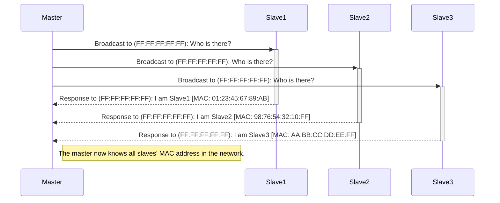
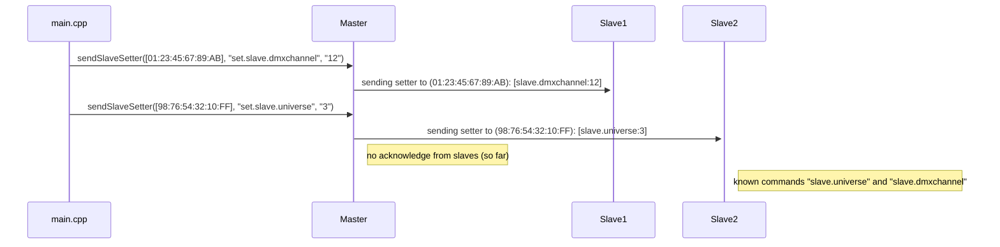
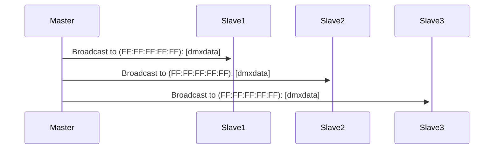
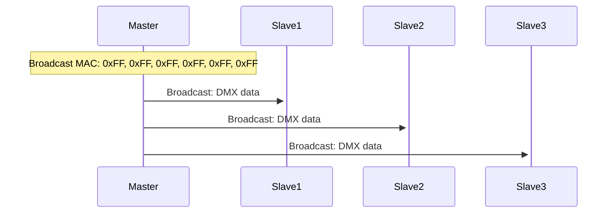

# DMXnow
A library for ESP32 and ESP32-C3 for sending DMX data from a Master device to slave devices.

# functionality
* broadcast DMX data from master to slaves
* request current universe, dmxchannel etc. from slaves
* sending individual setters to slaves to set universe, dmxchannel and all kinds of stuff
* [working example](https://github.com/kokospalme/DMXnow/tree/main/examples/DMXnow/Artnet2DMXnow_master) how to implement a master which receives artnet data over ethernet(with w5500 module), broadcasts it to the DMXnow environment, and has a serialHandler to change slaves dmxchannel etc. dynamic
* [working example](https://github.com/kokospalme/DMXnow/tree/main/examples/DMXnow/rgbdevice) how to implement a slave with WS2812 LEDs, which can be controlled over DMXnow

# libraries needed
```
lib_deps = 
	https://github.com/kokospalme/ESP32-DMX.git
	https://github.com/khoih-prog/AsyncUDP_ESP32_SC_Ethernet
	https://github.com/kokospalme/Artnet
	https://github.com/kokospalme/DMXnow
```

# ToDos
* [ ] test with many slaves
* [ ] test with full 4 universes
* [x] test sending 1 universe

# DMXnow environment
## registration process


## setter


## dmx data


slave's struct:
```cpp
typedef struct {
    uint8_t responsecode = 0;   //code for response
    uint8_t macAddress[6];      //slave's mac addres
    uint8_t wifiChannel = 0;    //wifichannel
    int8_t rssi = 0;           //signal strength
    uint8_t universe = 1;       //slave's universe from 0 ...16
    uint16_t dmxStart = 1;      //slave's sartaddress, starting at 1
    uint16_t dmxCount = 3;      //number of dmxchannels used    
} __attribute__((packed)) artnow_slave_t;
```

## sending DMX data
Dmx data is begin send to Mac address (0xFF:0xFF:0xFF:0xFF:0xFF:0xFF).


artnow package struct:
```cpp
typedef struct {
    uint8_t universe;   // DMX universe for this data, 254 for slave request
    uint8_t sequence;   // Sequence number
    uint8_t part;       // part (0...2)
    uint8_t data[];     // DMX data
} __attribute__((packed)) artnow_packet_t;
```

# Licence
This project is licensed under the Creative Commons Attribution-NonCommercial 4.0 International License. 

You are free to:
- Share: copy and redistribute the material in any medium or format
- Adapt: remix, transform, and build upon the material

Under the following terms:
- **Attribution**: You must give appropriate credit, provide a link to the license, and indicate if changes were made. You may do so in any reasonable manner, but not in any way that suggests the licensor endorses you or your use.
- **NonCommercial**: You may not use the material for commercial purposes.

No additional restrictions: You may not apply legal terms or technological measures that legally restrict others from doing anything the license permits.

See the [LICENSE](https://creativecommons.org/version4/) file for more details.
