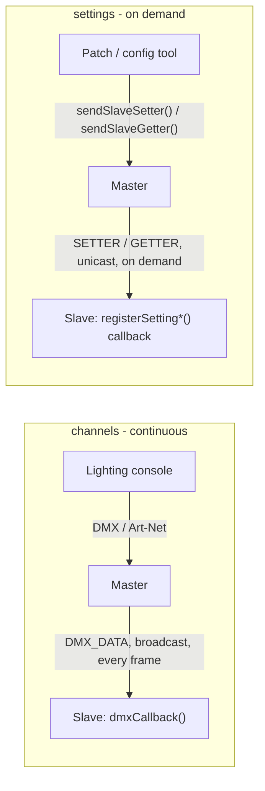
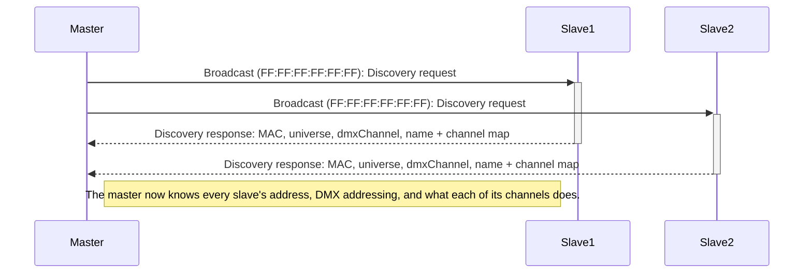
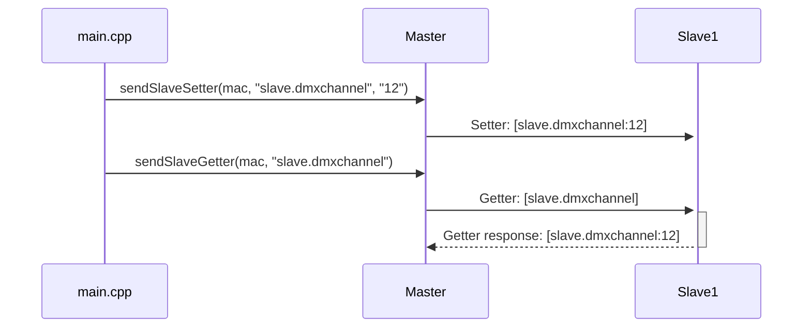
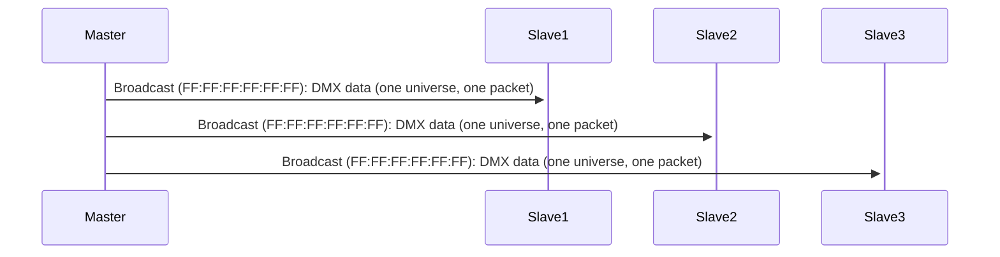

<p align="center"></p>

# DMXnow
A library for ESP32 and ESP32-C3 for sending DMX data from a Master device to slave devices.

## Contents
- [Functionality](#functionality)
- [Requirements](#requirements)
- [Libraries needed](#libraries-needed)
- [Two kinds of data: DMX channels vs. settings](#two-kinds-of-data-dmx-channels-vs-settings)
- [Protocol (v2)](#protocol-v2)
  - [Registration & capability discovery](#registration--capability-discovery)
  - [Channel capability map](#channel-capability-map)
  - [Multiple modes](#multiple-modes-eg-8bit-vs-16bit)
  - [Setter / getter](#setter--getter)
  - [DMX data](#dmx-data)
- [Credits & prior art](#credits--prior-art)
- [Licence](#licence)

# functionality
* broadcasts a full DMX universe (513 bytes incl. start code) from master to slaves in a **single ESP-NOW 2.0 packet** - no more splitting a universe into parts
* master can ask slaves what they are: each slave answers a discovery request with its address/universe/name **and a capability map of its DMX channels** (dimmer, shutter/strobe with value-dependent modes, RGB/RGBW/RGBWA/RGBWAU in 8 or 16 bit, pan/tilt, color wheel, gobo wheel, macro, ...), so a master can learn a fixture's DMX layout without any prior knowledge of the firmware
* sending individual setters to slaves to set universe, dmxchannel and all kinds of stuff
* generic getter: master can ask a slave for the current value of any named setting and gets a response back
* [working example](https://github.com/kokospalme/DMXnow/tree/main/examples/DMXnow/Artnet2DMXnow_master) how to implement a master which receives artnet data over ethernet(with w5500 module), broadcasts it to the DMXnow environment, and has a serialHandler to change slaves dmxchannel etc. dynamic
* [working example](https://github.com/kokospalme/DMXnow/tree/main/examples/DMXnow/rgbdevice) how to implement a slave with WS2812 LEDs, which can be controlled over DMXnow

# requirements
* Arduino ESP32 core >= 3.3.0 (ESP-NOW 2.0 / `ESP_NOW_MAX_DATA_LEN_V2` support)

# libraries needed
```
lib_deps = 
	https://github.com/kokospalme/ESP32-DMX.git
	https://github.com/khoih-prog/AsyncUDP_ESP32_SC_Ethernet
	https://github.com/kokospalme/Artnet
	https://github.com/kokospalme/DMXnow
```

# ToDos
* [ ] test with many slaves
* [ ] test with full 4 universes
* [x] test sending 1 universe
* [x] send a full universe in one ESP-NOW v2 packet instead of 3 fragments
* [x] let a slave describe its DMX channels' function/behavior to the master

# Two kinds of data: DMX channels vs. settings

DMXnow deliberately keeps two very different kinds of information apart, because they behave
completely differently on the wire, and mixing them up is the most common source of confusion
when adding a new fixture. Before touching either the channel capability map or the settings
registry, ask: **would a lighting designer animate this live from a console, or type it once into
a patch sheet?**

|                        | **DMX channel** (`dmxnow_channel_t`)                        | **Setting** (`dmxnow_setting_t`)                         |
|------------------------|--------------------------------------------------------------|-------------------------------------------------------------|
| What it is             | A live control value inside the DMX universe (Dimmer, RGB, Shutter, Pan/Tilt, Gobo, ...) | A configuration value of the *device itself* (DMX address, universe, bit depth, a default/failsafe scene, calibration, ...) |
| How often it changes   | Continuously - a console can move it every frame              | Rarely - usually once, when the fixture is patched or commissioned |
| How it travels         | Inside a `DMX_DATA` packet, at a fixed byte `offset`, broadcast to everyone whether or not it changed | As its own `SETTER`/`GETTER` packet, addressed to one slave, sent on demand |
| How a slave reads it   | Directly out of the DMX buffer in `dmxCallback()`, every frame | Via a typed callback the library invokes for you, only when that one value is actually sent |
| How it's declared      | `DMXnow::setSlaveChannels(mode, ...)` - part of a mode's channel map (see below) | `DMXnow::registerSettingUint8/Uint16/Int8/Int16/Bool/String(...)` (see [setter / getter](#setter--getter)) |
| How a master learns it | reads `dmxnow_slave_t::modes[mode].channels[]` after discovery | reads `dmxnow_slave_t::settings[]` after discovery |


```mermaid
flowchart LR
    subgraph chan["channels - continuous"]
        console[Lighting console] -->|DMX / Art-Net| master1[Master]
        master1 -->|"DMX_DATA, broadcast, every frame"| slave1["Slave: dmxCallback()"]
    end
    subgraph sett["settings - on demand"]
        patchtool["Patch / config tool"] -->|"sendSlaveSetter() / sendSlaveGetter()"| master2[Master]
        master2 -->|"SETTER / GETTER, unicast, on demand"| slave2["Slave: registerSetting*() callback"]
    end
```

A concrete example, taken from a real fixture built with DMXnow, shows both - using almost the
same word for two entirely different things, which is exactly the trap this split avoids:

- Its **Dimmer** is a live DMX **channel** (`DMXNOW_FN_DIMMER` at some `offset`): it arrives with
  every DMX frame, is never requested or set individually, and is only *described* (never
  transmitted on its own) via the capability map.
- Its `slave.scene.brightness` is a **setting**: the persisted *default/failsafe* brightness the
  fixture falls back to when no DMX signal is present. It has nothing to do with the live Dimmer
  channel above - it's configuration, so it's declared with `registerSettingUint8()` instead.

If you're ever unsure which one to use for a new value: settings are cheap to add and read back
(a few bytes in the discovery response), channels are relatively expensive (a whole
`dmxnow_channel_t` slot, see the size budget in [channel capability map](#channel-capability-map)) -
so when in doubt, and the value isn't something a console needs to fade or bump every frame, it's
almost certainly a setting.

# protocol (v2)

Every DMXnow packet starts with a common header:

```
    0                   1                   2                   3
    0 1 2 3 4 5 6 7 8 9 0 1 2 3 4 5 6 7 8 9 0 1 2 3 4 5 6 7 8 9 0 1
   +-+-+-+-+-+-+-+-+-+-+-+-+-+-+-+-+-+-+-+-+-+-+-+-+-+-+-+-+-+-+-+-+
   |                     Magic ("DMXN", 0x44584D4E)               |
   +-+-+-+-+-+-+-+-+-+-+-+-+-+-+-+-+-+-+-+-+-+-+-+-+-+-+-+-+-+-+-+-+
   |    Version    |     Type      |          Sequence            |
   +-+-+-+-+-+-+-+-+-+-+-+-+-+-+-+-+-+-+-+-+-+-+-+-+-+-+-+-+-+-+-+-+
   |     Flags     |
   +-+-+-+-+-+-+-+-+
```

`Type` selects what follows the header:

| Type | Name                  | Direction        | Payload                                    |
|-----:|-----------------------|-------------------|---------------------------------------------|
| 0x00 | DMX data              | master -> slaves  | universe, offset, length, up to 513 bytes   |
| 0x01 | Discovery request     | master -> slaves  | (none)                                      |
| 0x02 | Discovery response    | slave -> master   | address/universe/name + channel capability map |
| 0x03 | Setter                | master -> slave   | name, value (strings)                       |
| 0x04 | Getter                | master -> slave   | name (string)                               |
| 0x05 | Getter response       | slave -> master   | name, value (strings)                       |

`Flags`: `RESET` (0x01, set right after a transmitter's sequence counter (re)started) and `NEW` (0x02, payload changed since the last transmission).

Because ESP-NOW 2.0 carries up to 1470 bytes per packet, a full DMX universe (start code + 512
slots = 513 bytes) always fits in a single "DMX data" packet - a receiver no longer has to
reassemble a frame from several fragments.

## registration & capability discovery

```mermaid
sequenceDiagram
    participant Master
    participant Slave1
    participant Slave2

    Master ->>+ Slave1: Broadcast (FF:FF:FF:FF:FF:FF): Discovery request
    Master ->>+ Slave2: Broadcast (FF:FF:FF:FF:FF:FF): Discovery request

    Slave1 -->>- Master: Discovery response: MAC, universe, dmxChannel, name + channel map
    Slave2 -->>- Master: Discovery response: MAC, universe, dmxChannel, name + channel map

    Note right of Master: The master now knows every slave's address, DMX addressing, and what each of its channels does.
```

### channel capability map
A discovery response carries up to `DMXNOW_MAX_CHANNELS` (see `DMXnow.h`) `dmxnow_channel_t`
entries, one per logical DMX function. Each has an `offset` (0-based, relative to the slave's
`dmxChannel`), a `type` (`DMXNOW_FN_DIMMER`, `DMXNOW_FN_SHUTTER_STROBE`, `DMXNOW_FN_RGB`,
`DMXNOW_FN_RGBW`, `DMXNOW_FN_RGBWA`, `DMXNOW_FN_RGBWAU`, `DMXNOW_FN_PAN`/`TILT`,
`DMXNOW_FN_COLOR_WHEEL`, `DMXNOW_FN_GOBO_WHEEL`, `DMXNOW_FN_MACRO`, `DMXNOW_FN_SPEED`, ...), a
bit depth (`DMXNOW_BITS_8`/`DMXNOW_BITS_16`), and up to `DMXNOW_MAX_ZONES_PER_CHANNEL` `zones[]` -
value sub-ranges that describe how the channel behaves at different DMX values.

Example matching the motivating use case (a shutter channel where 0-9 means no strobe, 10-135
strobes linearly between 0 and 20Hz, and 136-255 strobes randomly):

```cpp
dmxnow_channel_t shutter;
shutter.offset = 1; // second logical channel
shutter.type = DMXNOW_FN_SHUTTER_STROBE;
shutter.bits = DMXNOW_BITS_8;
shutter.zoneCount = 3;
shutter.zones[0] = { 0,   9,  DMXNOW_STROBE_OFF,    0,   0, "Off"    };
shutter.zones[1] = { 10, 135, DMXNOW_STROBE_LINEAR,  0, 200, "Linear" }; // 0.0Hz -> 20.0Hz (param is Hz*10)
shutter.zones[2] = { 136,255, DMXNOW_STROBE_RANDOM,  0,   0, "Random" };
```

`zones[].mode` is interpreted according to the channel's `type`: `DMXNOW_STROBE_*` for
`DMXNOW_FN_SHUTTER_STROBE`, or an opaque slot/program id (named by `label`) for
`DMXNOW_FN_COLOR_WHEEL`, `DMXNOW_FN_GOBO_WHEEL` and `DMXNOW_FN_MACRO`.

`value_from`/`value_to` are plain `uint8_t`, so a zone can legitimately span up to 255 - there's
no library-side limit, zones are pure metadata that nothing in DMXnow itself evaluates at
runtime. It's the fixture firmware's job to keep the zone table honest: if channel behavior above
some value is genuinely undefined, just leave it out of the zone table rather than describing it.

### multiple modes (e.g. 8bit vs. 16bit)

A device can register more than one channel map under different mode indices
(`0 .. DMXNOW_MAX_MODES-1`, default cap 2 - raise it in `DMXnow.h` if a fixture genuinely needs
more, it's a real RAM multiplier both on the slave and in the master's per-slave bookkeeping).
Only one mode is *active* (driving the real DMX reception) at a time, but the master can learn
**every** registered mode's map without ever having to switch the device's live mode:

```cpp
// slave, once at boot: register both modes, whichever is actually running last (makeActive)
dmxnow_channel_t channels8bit[N];  /* ... fill in ... */
dmxnow_channel_t channels16bit[N]; /* ... fill in, same offsets/types, DMXNOW_BITS_16 ... */
DMXnow::setSlaveChannels(0, "8bit",  dmxCount8,  channels8bit,  N, false);
DMXnow::setSlaveChannels(1, "16bit", dmxCount16, channels16bit, N, false);
DMXnow::setActiveMode(config.is16bit ? 1 : 0);

// later, when the mode setter actually changes it live:
DMXnow::setActiveMode(config.is16bit ? 1 : 0);
```

```cpp
// master: a broadcast discovery only returns each slave's *active* mode. To learn a specific
// slave's other mode(s) - e.g. to preview what a fixture would look like in 16bit - ask it
// directly by unicast, without switching it:
DMXnow::sendSlaveModeRequest(slaveMac, 1 /* mode */);
// ... later, once the response has arrived:
const dmxnow_slave_t* slave = DMXnow::getSlaveByMac(slaveMac);
if (slave && slave->modes[1].known) {
    // slave->modes[1].channels[...] now holds that mode's map, slave->modes[1].dmxCount its footprint
}
```

A slave declares its (first, or only) mode with `DMXnow::setSlaveChannels(mode, modeName,
dmxCount, channels, count)`; the master reads a device's per-mode maps back via
`DMXnow::getSlave(index)->modes[mode]` / `DMXnow::getSlaveByMac(mac)->modes[mode]`, or by
registering `DMXnow::setDiscoveryCallback(...)` (called on every discovery response, i.e. once
per mode learned).

## setter / getter

```mermaid
sequenceDiagram
    participant main.cpp
    participant Master
    participant Slave1

    main.cpp ->> Master: sendSlaveSetter(mac, "slave.dmxchannel", "12")
    Master ->>+ Slave1: Setter: [slave.dmxchannel:12]

    main.cpp ->> Master: sendSlaveGetter(mac, "slave.dmxchannel")
    Master ->>+ Slave1: Getter: [slave.dmxchannel]
    Slave1 -->>- Master: Getter response: [slave.dmxchannel:12]
```

Names and values travel as plain strings on the wire (`sendSlaveSetter`/`sendSlaveGetter`), but a
slave doesn't have to parse them by hand. Declare each named setting once at boot, **before**
`DMXnow::initSlave()`, with its data type and valid range - DMXnow then parses, range-checks and
dispatches it to a callback written in its natural type:

```cpp
void onUniverseSetting(const uint8_t* macAddr, uint8_t value) {
    config.universe = value; // already validated to be 0..16
    // ... persist, DMXnow::setSlaveconfig(...), etc.
}
uint8_t getUniverseSetting(const uint8_t* macAddr) {
    return config.universe;
}

void setup() {
    // ...
    DMXnow::registerSettingUint8("slave.dmxuniverse", 0, 16, onUniverseSetting, getUniverseSetting);
    DMXnow::registerSettingBool("slave.mode", onModeSetting);              // set-only (no getCb)
    DMXnow::registerSettingString("slave.scene.color1", 11, onColor1Setting, getColor1Setting);
    DMXnow::initSlave();
}
```

Available types: `registerSettingUint8/Uint16/Int8/Int16/Bool/String`. Either callback may be
`nullptr` - a get-only setting (e.g. a sensor reading) omits the setter, a set-only one omits the
getter. A value outside the declared range, or of the wrong shape (e.g. non-numeric for a uint8
setting), is rejected before the callback is ever called - the handler only ever sees valid input.

Just like the channel capability map, every registered setting's name/type/range is advertised in
the discovery response (mode-independent, since settings configure the device itself), so a
master can build a UI for them without hardcoding any setting names - see `dmxnow_slave_t::settings[]`.

A setter/getter for a name that was never registered this way still reaches the old free-form
callbacks (`DMXnow::setSetterCallback`/`setGetterCallback`, `(macAddr, name, value)` as plain
strings) if one is set - useful for one-off or dynamically-named settings that don't fit a fixed
schema.

## dmx data

```mermaid
sequenceDiagram
    participant Master
    participant Slave1
    participant Slave2
    participant Slave3

    Master ->>+ Slave1: Broadcast (FF:FF:FF:FF:FF:FF): DMX data (one universe, one packet)
    Master ->>+ Slave2: Broadcast (FF:FF:FF:FF:FF:FF): DMX data (one universe, one packet)
    Master ->>+ Slave3: Broadcast (FF:FF:FF:FF:FF:FF): DMX data (one universe, one packet)
```

# Credits & prior art
* Originally inspired by [Blinkinlabs/esp-now-dmx](https://github.com/Blinkinlabs/esp-now-dmx).
* Protocol v2's core idea - carrying an entire DMX universe in a single ESP-NOW 2.0 packet instead
  of fragmenting it, and negotiating a non-legacy PHY rate per peer so ESP-NOW actually grants that
  larger packet size - was inspired by a draft/work-in-progress DMX-over-ESP-NOW-2.0
  implementation by [Carsten Koester](https://github.com/carstenkoester/DMXNow). The wire format, capability discovery,
  multi-mode and typed settings mechanisms here are a fresh implementation built around this
  library's own (static-class, C-style) architecture, not a port of that code.

# Licence
This project is licensed under the Creative Commons Attribution-NonCommercial 4.0 International License. 

You are free to:
- Share: copy and redistribute the material in any medium or format
- Adapt: remix, transform, and build upon the material

Under the following terms:
- **Attribution**: You must give appropriate credit, provide a link to the license, and indicate if changes were made. You may do so in any reasonable manner, but not in any way that suggests the licensor endorses you or your use.
- **NonCommercial**: You may not use the material for commercial purposes.

No additional restrictions: You may not apply legal terms or technological measures that legally restrict others from doing anything the license permits.

See the [LICENSE](https://creativecommons.org/version4/) file for more details.
