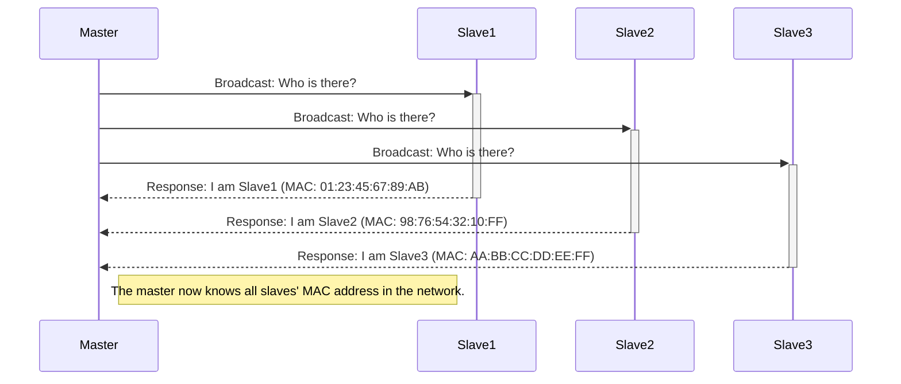

# DMXnow
a library for ESP32 and ESP32-C3 to send DMX data from one device to another.

# DMXnow environment
## registration process


slave's struct:
```cpp
typedef struct {
    uint8_t responsecode = 0;   //code for response
    uint8_t macAddress[6];      //slave's mac addres
    uint8_t wifiChannel = 0;    //wifichannel
    int8_t rssi = 0;           //signal strength
    uint8_t universe = 1;       //slave's universe from 0 ...16
    uint16_t dmxStart = 1;      //slave's sartaddress, starting at 1
    uint16_t dmxCount = 3;      //number of dmxchannels used    
} __attribute__((packed)) artnow_slave_t;
```

## sending DMX data
Dmx data is begin send to Mac address (0xFF:0xFF:0xFF:0xFF:0xFF:0xFF).


artnow package struct:
```cpp
typedef struct {
    uint8_t universe;   // DMX universe for this data, 254 for slave request
    uint8_t sequence;   // Sequence number
    uint8_t part;       // part (0...2)
    uint8_t data[];     // DMX data
} __attribute__((packed)) artnow_packet_t;
```

# Licence
This project is licensed under the Creative Commons Attribution-NonCommercial 4.0 International License. 

You are free to:
- Share: copy and redistribute the material in any medium or format
- Adapt: remix, transform, and build upon the material

Under the following terms:
- **Attribution**: You must give appropriate credit, provide a link to the license, and indicate if changes were made. You may do so in any reasonable manner, but not in any way that suggests the licensor endorses you or your use.
- **NonCommercial**: You may not use the material for commercial purposes.

No additional restrictions: You may not apply legal terms or technological measures that legally restrict others from doing anything the license permits.

See the [LICENSE](https://creativecommons.org/version4/) file for more details.
